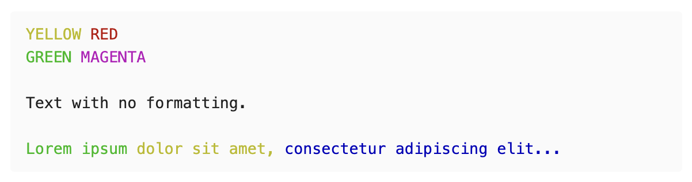
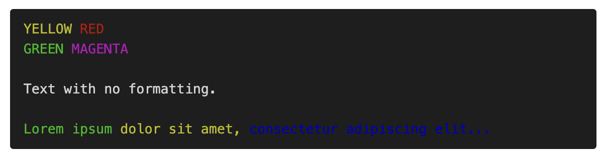

# Obsidian ANSI Viewer

This is a plugin for Obsidian Notes (https://obsidian.md).

When enabled, code blocks marked with the string `ansi` will be rendered according to standard ANSI formatting.

This allows for color coded text taken directly from terminal outputs. I created this plugin specifically so that I could copy terminal output from iTerm2 and save it into my notes.

If you are using iTerm2, highlight the desired text and use the option **Copy with Control Sequences**. Paste the result in the code block.

<span style="color: red">**THIS PROJECT IS A WORK IN PROGRESS AND IS NOT FULLY TESTED!**</span>

<span style="color: red">**INSTALL AT YOUR OWN RISK. ENSURE THAT YOUR NOTES ARE BACKED UP BEFORE INSTALLING.**</span>

## Features

- Render ANSI formatting codes just like a terminal does!
- Support for _almost_ all codes
- Dark mode
- Support iTerm2's weird control sequences (configurable)
- Support for multiline formatting (configurable)

## Usage

Simply create a code block with the word "ansi" and paste in your code.

_NOTE: Actual escape sequences may not be rendered in Obsidian. This plugin supports the use of string literals which evaluate to the escape sequence: `\x1b`, `\e`, `\033` etc_

~~~
```ansi
\x1b[0;33mYELLOW\x1b[0m \x1b[0;31mRED\x1b[0m\x1b[0m
\x1b[0;32mGREEN\x1b[0m \x1b[0;35mMAGENTA\x1b[0m

Text with no formatting.

\x1b[0;32mLorem ipsum \x1b[0;33mdolor sit amet, \x1b[0;34mconsectetur adipiscing elit...\x1b[0m
```
~~~



There is also a dark mode which can be enabled by adding the keyword `dark` after `ansi`:

~~~
```ansi dark
\x1b[0;33mYELLOW\x1b[0m \x1b[0;31mRED\x1b[0m\x1b[0m
\x1b[0;32mGREEN\x1b[0m \x1b[0;35mMAGENTA\x1b[0m

Text with no formatting.

\x1b[0;32mLorem ipsum \x1b[0;33mdolor sit amet, \x1b[0;34mconsectetur adipiscing elit...\x1b[0m
```
~~~



## Important Caveats

- iTerm2 has an unusual way of formatting certain sequences. This plugin can account for them but those codes may not behave the same if pasted into a different terminal. You can disable this behavior by toggling the option "Correct iTerm2 formatting" (enabled by default).

- Strikethrough text and blinking text are not supported. This appears to be a limitation of ansi_up, a dependency this plugin uses. I intend to submit a pull request to fix this.

## Planned Features

- Full support for Obsidian dark mode
- Configureable default dark/light mode
- Configurable terminal colors
- Support for strikethrough and blinking text