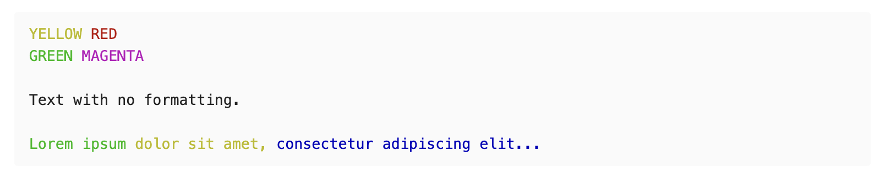

# Obsidian ANSI Viewer

This is a plugin for Obsidian Notes (https://obsidian.md).

When enabled, code blocks marked with the string `ansi` will be rendered according to standard ANSI formatting.

This allows for color coded text taken directly from terminal outputs. I created this plugin specifically so that I could copy terminal output from iTerm2 and save it into my notes.

If you are using iTerm2, highlight the desired text and use the option **Copy with Control Sequences**. Paste the result in the code block.

<span style="color: red">**THIS PROJECT IS A WORK IN PROGRESS AND IS NOT FULLY TESTED!**</span>

<span style="color: red">**INSTALL AT YOUR OWN RISK. ENSURE THAT YOUR NOTES ARE BACKED UP BEFORE INSTALLING.**</span>

## Usage

Simply create a code block with the word "ansi" and paste in your code.

_NOTE: Escape sequences may not be rendered in Obsidian._

~~~
```ansi
YELLOW RED
GREEN MAGENTA

Text with no formatting.

Lorem ipsum dolor sit amet, consectetur adipiscing elit...
```
~~~



## Important Caveats

- Currently, ANSI code blocks can only recognize the escape sequence which is not usually visible in terminal outputs. The above example has escape sequences which cannot be displayed by Markdown. Eventually, support will be added for character literal escape sequences like "\e" and "\033".

- iTerm2 has an unusual way of formatting certain sequences which this plugin cannot (yet) read. When iTerm2 renders text using RGB color sequences, the result cannot be parsed. Basic 8-bit colors (which are more common) work just fine.