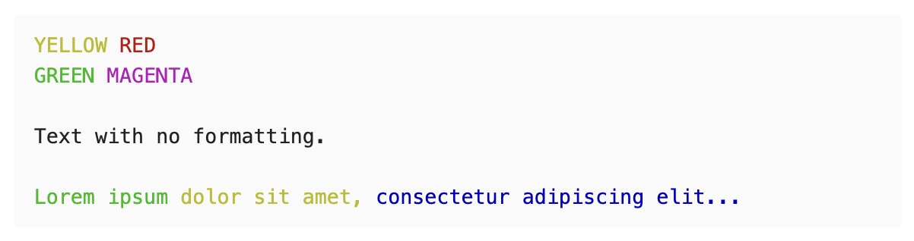
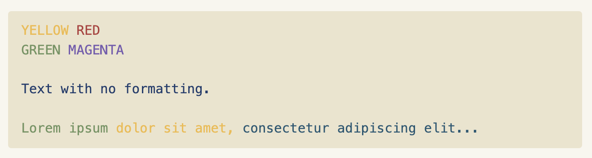
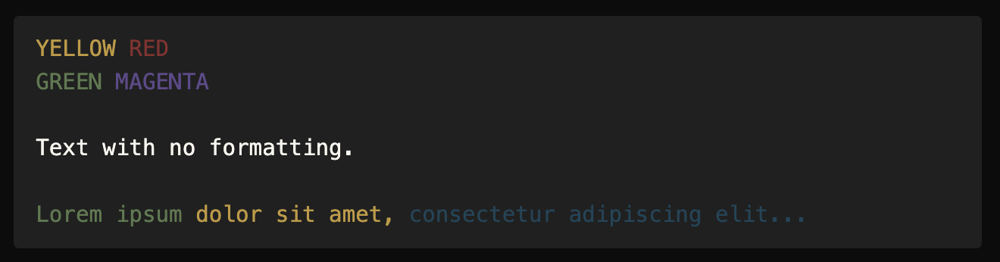
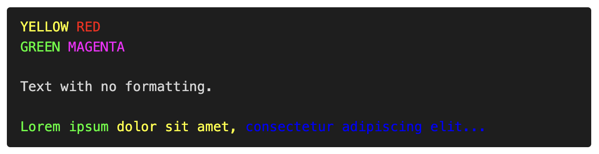

# Obsidian ANSI Viewer

Render ANSI-formatted terminal output in code blocks.

This allows for color coded text taken directly from terminal outputs. I created this plugin specifically so that I could copy terminal output from iTerm2 and save it into my notes.

If you are using iTerm2, highlight the desired text and use the option **Copy with Control Sequences**. Paste the result in the code block.

## Features

- Render ANSI formatting codes just like a terminal does
- Support for _almost_ all codes
- Match the current theme and all colors by default (configurable)
- Configurable dark and light mode with custom colors
- Support for strings representing the escape sequence (configurable)
- Support iTerm2's weird control sequences (configurable)
- Support for multiline formatting (configurable)

## Usage

Simply create a code block with the word "ansi" and paste in your code.

_NOTE: Actual escape sequences may not be rendered in Obsidian._

~~~
```ansi
\x1b[0;33mYELLOW\x1b[0m \x1b[0;31mRED\x1b[0m\x1b[0m
\x1b[0;32mGREEN\x1b[0m \x1b[0;35mMAGENTA\x1b[0m

Text with no formatting.

\x1b[0;32mLorem ipsum \x1b[0;33mdolor sit amet, \x1b[0;34mconsectetur adipiscing elit...\x1b[0m
```
~~~



### Literal Escape Codes

By default, both real escape sequences and those represented by strings will be used to evaluate the codes. This behavior is controlled by the **Convert string escape sequences to literal escape sequences** setting.

You can set this behavior per block using the keywords `esc_real` to consider only actual escape sequences or `esc_string` to consider strings such as "\x1b", "\e" or "\033" as escape sequences.

## Themes

The **Default theme** setting controls how ansi code blocks are displayed globally. Choose "Current theme" to match the active Obsidian theme (default), or "ANSI Viewer dark" / "ANSI Viewer light" to use the plugin's customizable colors everywhere.

The "Current Theme" option will have code blocks match, not only the current theme, but Obsidians dark/light mode.

_Code block with the RetroNotes theme and Obsidian in light mode_



_Code block with the RetroNotes theme and Obsidian in dark mode_



You can override the global theme setting on a per-block basis adding the right keyword after `ansi`:
- `theme` -> Match Obsidians current theme and dark/light mode
- `dark` -> Use ANSI Viewers customizable dark theme
- `light` -> Use ANSI Viewers customizable light theme

_Code block using `dark` keyword with Obsidians default theme in light mode_



## Important Caveats

- iTerm2 has an unusual way of formatting certain sequences. This plugin can account for them but those codes may not behave the same if pasted into a different terminal. You can disable this behavior by toggling the option "Correct iTerm2 formatting" (enabled by default).

- iTerm2 also offsets codes used for bright background colors by +8. The option "Correct iTerm2 formatting" will also correct for this.

- Strikethrough text and blinking text are not supported. This is a limitation of [ansi_up](https://github.com/drudru/ansi_up), a dependency this plugin uses.

## Third-party licenses

This plugin bundles [ansi_up](https://github.com/drudru/ansi_up), which is distributed under the MIT License:

```
The MIT License

Copyright (c) 2011 github.com/drudru

Permission is hereby granted, free of charge, to any person obtaining
a copy of this software and associated documentation files (the
'Software'), to deal in the Software without restriction, including
without limitation the rights to use, copy, modify, merge, publish,
distribute, sublicense, and/or sell copies of the Software, and to
permit persons to whom the Software is furnished to do so, subject to
the following conditions:

The above copyright notice and this permission notice shall be
included in all copies or substantial portions of the Software.

THE SOFTWARE IS PROVIDED 'AS IS', WITHOUT WARRANTY OF ANY KIND,
EXPRESS OR IMPLIED, INCLUDING BUT NOT LIMITED TO THE WARRANTIES OF
MERCHANTABILITY, FITNESS FOR A PARTICULAR PURPOSE AND NONINFRINGEMENT.
IN NO EVENT SHALL THE AUTHORS OR COPYRIGHT HOLDERS BE LIABLE FOR ANY
CLAIM, DAMAGES OR OTHER LIABILITY, WHETHER IN AN ACTION OF CONTRACT,
TORT OR OTHERWISE, ARISING FROM, OUT OF OR IN CONNECTION WITH THE
SOFTWARE OR THE USE OR OTHER DEALINGS IN THE SOFTWARE.
```
